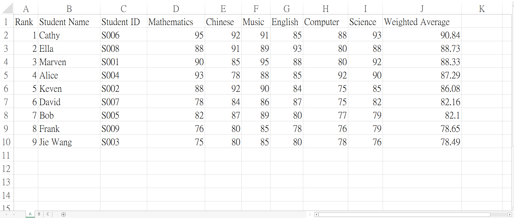

# Grade Management System

This project is a grade management system that processes student data, calculates weighted scores, and generates a report in Excel format. The system reads student data from a JSON file, processes the grades, and exports the results to an Excel file, categorized by class.

## Features
- **Load Student Data**: Import student data from a JSON file.
  - **Subject Management**: Each student has core and elective subjects with scores and weights.
  - **Grade Calculation**: Calculates weighted scores and averages for students.
  - **Excel Export**: Generates an Excel report by class, including the rank, student name, ID, subject scores, and weighted averages.
  - **Folder Structure**: The Excel report is saved in the `output` directory with a timestamp-based filename.

## Prerequisites
Make sure you have the following installed:
- **Java 8+**
  - **Apache POI** (for Excel file handling)
  - **Jackson** (for JSON parsing)

### Dependencies
This project uses the following libraries:
- **Apache POI** for creating and manipulating Excel files.
  - **Jackson** for parsing JSON data.
  - **Java Collections** for managing student and subject data.

Make sure to include these libraries in your project dependencies.

## Setup

1. **Clone the Repository:**
   ```bash
   git clone <repository_url>

   2. **Build the Project: If you are using Maven, you can build the project with the following command:**
      ```bash
      mvn clean install
      ```
   
   3. **Prepare the students.json File: Create a students.json file containing the student data in the following format:**
      ```json
       {
         "ClassA": [
           {
             "name": "John Doe",
             "id": "S12345",
             "subjects": [
               { "name": "Math", "type": "core", "score": 85 },
               { "name": "English", "type": "core", "score": 90 }
             ]
           },
           ...
         ],      
         "ClassB": [
           {
             "name": "Jane Smith",
             "id": "S12345",
             "subjects": [
               { "name": "Math", "type": "core", "score": 85 },
               { "name": "English", "type": "core", "score": 90 }
             ]
           },
           ...
         ]
       }
      ``` 
   4. **To start the program and generate the report, run the `main.java` class:**

      ```bash
      java main
      ```
      This will generate an Excel report in the output directory with a timestamped filename like report_YYYYmmDD_HHMMSS.xlsx.

## Output

The Excel report will be saved in the `output` folder (if the folder does not exist, it will be created).  
Each class will have its own worksheet with the following columns:
- **Rank**
  - **Student Name**
  - **Student ID**
  - **Subject Scores** (Each subject will have its own column)
  - **Weighted Average** (Calculated based on subject scores and weights)

### Example of Excel Output:

| Rank | Student Name | Student ID | Math | English | Weighted Average |
|------|--------------|------------|------|---------|------------------|
| 1    | John Doe     | S12345     | 85   | 90      | 87.5             |
| 2    | Jane Smith   | S67890     | 78   | 88      | 83.0             |

#### Excel Preview


##### Command Output
.png)
.png)


## License

This project is licensed under the MIT License - see the LICENSE file for details.

